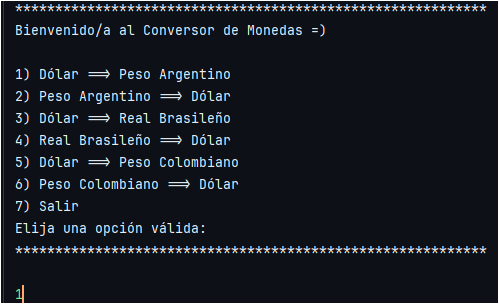
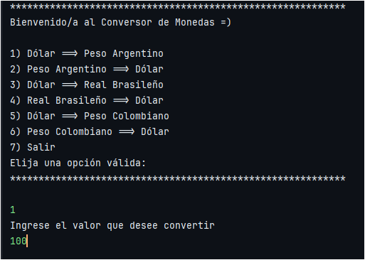
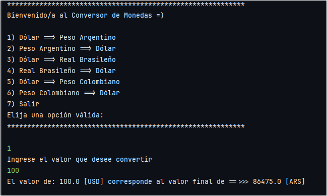

# Challenge Conversor de Monedas

---

## Introducción

Esta aplicación de Java es un convertidor de monedas que permite a los usuarios convertir cantidades de una moneda a otra. Utiliza tasas de cambio en tiempo real para realizar las conversiones.

Actualmente se tienen 3 pares de conversión de monedas.

Para nuestro actual desafío, hemos elegido la API **_"Exchange Rate API"_** por sus tasas de cambio en tiempo real, proporcionando información precisa y actualizada para nuestras conversiones de moneda.

---

## Instalación

1. Clona o descarga el repositorio desde [GitHub](https://github.com/Domegal13/challenge-conversor-de-monedas).
2. Importa el proyecto en tu IDE de Java preferido.
3. Asegúrate de tener una conexión a internet para que la aplicación pueda obtener las tasas de cambio más recientes.

---

## Uso

1. Ejecuta la aplicación.
2. Selecciona un opción del menú. (De acuerdo al cambio que desees realizar).

   

3. Ingresa la cantidad que deseas convertir.

   

4. Presiona la tecla "Enter".
5. La aplicación mostrará el resultado de la conversión en pantalla.

   

---

# Contacto

- [GitHub](https://github.com/Domegal13)
- [Linkedin](https://www.linkedin.com/in/domegal13/)
- [Email](mailto:domegal13.dev@gmail.com "domegal13.dev@gmail.com")

---

# Autor del Proyecto:

### Domegal13.dev
